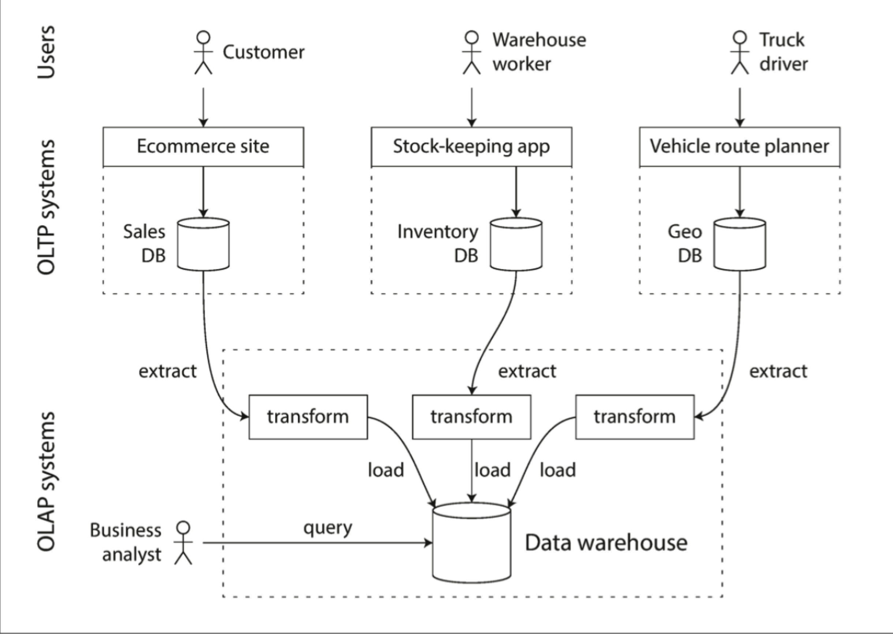
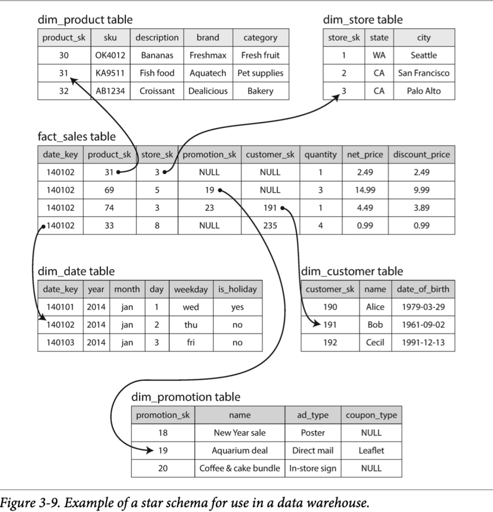

+++
template = "ddia_page.html"
date = "2021-02-02 18:39:18"
title = "Chapter3 Storage & Retrieval"
weight = 3
+++

> 如果你保持事务的有序性，你就懒得去寻找 -- German proverb

在最共有的常识层面上讲，数据库需要做两件事：存储你的数据，当你需要时将数据给你。

在第 2 章我们讨论了数据模型和查询语言--即你给数据库的你的数据格式，以及你如何查询到你存储的数据。本章中，我们继续延续这个视角讨论：我们如何存储数据，以及如何检索到它。

为什么一个应用开发者需要关系数据库内部如何存储和检索数据？你可能不会实现自己的存储引擎，但是你肯定需要从多个存储引擎中挑选适合自己应用的。为了针对你的业务负载调优存储，你需要更深入的了解存储引擎。

尤其是，在优化事务和分析方面，存储引擎的差异是巨大的。我们在稍后的"**事务处理或者分析？**"一节讨论，然后在 "**Column-Orented Storage**"讨论一系列为了分析优化的存储引擎

然后，本章让我们首先来讨论你很熟悉的存储引擎：传统关系型数据库，以及 NoSQL 数据库。我们将要讨论两种存储引擎家族：log-structured 存储引擎， page-oriented 存储引擎比如 B-tree

## 数据结构使能你的数据库 (Data Structures That Power Your Database)

考虑最简单的数据库，使用两个 Bash 函数实现 :

```shell
#!/bin/bash

db_set() {
	echo "$1,$2" >> database 
}

db_get() {
	grep "^$1," database | sed -e "s/^$1,//" | tail -n 1
}
```

这两个函数实现了一个 key-value 存储。你可以调用 `db_set key value`，就可以将 key 和 value 存储到数据库。key 和 value 可以是任何类型--比如，value 可以是 json 文档。然后你可以调用 `db_get key`，可以检索到对应 key 的最新的 value 返回。

比如下面的流程

```shell
$ db_set 123456 '{"name":"London","attractions":["Big Ben","London Eye"]}'
$ db_set 42 '{"name":"San Francisco","attractions":["Golden Gate Bridge"]}'
$ db_get 42
{"name":"San Francisco","attractions":["Golden Gate Bridge"]}
```

底层的存储格式非常简单：文本文件一行包含一个 key-value 对，通过逗号分隔（类似 csv 文件）。每次`db_set`的调用都会追加在文件末尾，即使你更新 key 的 value，老版本的 value 也不会被覆盖--你需要查看文件中 key 对应的最新的 value

```shell
$ db_set 42 '{"name":"San Francisco","attractions":["Exploratorium"]}'
$ db_get 42
{"name":"San Francisco","attractions":["Exploratorium"]}
$ cat database
123456,{"name":"London","attractions":["Big Ben","London Eye"]} 
42,{"name":"San Francisco","attractions":["Golden Gate Bridge"]} 
42,{"name":"San Francisco","attractions":["Exploratorium"]}
```

我们的`db_set`函数如此简单而且高性能，因为在文件末尾追加效率很高。类似`db_set`做的事情一样，很多数据库内部使用 *log*，就是一个只追加的数据文件。生产环境的数据库更多的还要处理比如并发控制，回收硬盘空间，log 不能一直增长，错误处理，部分写入记录等问题，但是基本原理是相同的。Log 是非常有用的，我们将在本书的其余部分经常提到

> *log *通常表示应用的日志，描述应用行为的文本记录。在本书中，log 更多的表示这样的场景：一个只追加的 record 序列。不一定有对人类友好的可读性，可能是二进制或者只会被其他程序读取

另一方面，我们的`db_set`函数性能又很差，如果你在数据库中有巨量的数据的话。每次你检索一个 key，`db_get`要扫描整个数据库文件，找到 key 出现的位置。在算法角度，这个检索的复杂度是 O(n)：如果你的数据量成倍增长，检索时间也会成倍增长。

为了更有效率的检索特定的 key，我们需要另一个数据结构：*index（索引）*。在本章中，我们将会探讨一系列的索引结构，然后对比它们。它们**背后共同的思想就是维持一些额外的 metadata，来像路标一样帮助你定位你要检索的数据**。如果你想要通过不同的方法检索相同的数据，你可能需要为这份数据建立不同的索引

索引就是建立于你的数据的额外结构。很多数据库允许你建立和移除索引，同时不会影响到数据库的数据，只会影响检索的效率。建立额外的数据结构意味着增加开销，尤其是写入开销。对于写入来说，很难超越直接追加文件的性能，因为是最简单的写入操作。任何类型的索引通常会减慢写入，因为每次写入数据都要更新索引

这在存储系统中时一个重要的权衡：良好的索引可以加速查询，但是每个索引都会降低写入性能。因此，数据库默认不建立索引，而是要求你--应用开发者或者数据库管理员选择如何建立索引，来适用于你的应用的特定查询。你就可以为自己的应用选择最适合的索引建立，又不会引入过多的写入开销。

### Hash Indexes

让我们首先讨论 key-value 数据的索引。这不是仅有的可以索引的数据类型，但是很常见，而且对于更复杂索引的子块。

key-value 存储非常类似于你可以在大多数编程语言中看到的字典类型，其通常使用 hash map（hash table）实现。hash map 很多算法书中都有描述，所以这里不展开。所以我们已经在内存有了 hash map，为什么还要在硬盘中建立数据的索引

假设我们的数据文件如同上文所述，是只追加的文件。最简单的建立索引的策略是：在内存的 hash map 中维护 key-file offset 的数据。当你新追加数据到数据库中时，还要更新内存中的 hash map。检索数据时，先查内存的 hash map，然后按照得到的 offset 直接读文件即可

如下图所示


这听起来可能很简单，但是是一种可行的办法。实际上，这基本就是 Bitcask （Riak 的默认存储引擎）。Bitcask 提供了高性能读写，但是要求 key 尽可能小能在 RAM 存储，因为 hash map 全部保持在内存中。值可以用比内存更多的空间，因为可以从硬盘中加载。如果数据文件在文件系统的 cache 中，读操作都不需要硬盘 I/O

Bitcask 存储引擎适合频繁更新的场景。比如，key 是一个猫片的 url，value 是播放次数。这个场景中，写入次数太多，而且没有很多 key，每个 key 都要大量写入，就很适合使用 Bitcask

上文中，我们将所有数据追加到一个文件中，所以如何避免撑爆硬盘空间？一个好的解决方案是通过将达到一定大小的文件 close，然后新 open 一个文件继续操作。然后我们可以在关闭的文件上执行 *compaction* 操作，如下图所示。Compaction 意味着丢弃 log 中的重复 key，只保持最新的 value 行


此外，compaction 通常会是段文件变小（假设一个 key 会在一个段文件中重复几次），因此我们还可以合并几个段文件，如下图所示。段文件在写入到硬盘后不会发生变更，所以合并后的段文件要写到新的文件中。merge 和 compaction 的操作可以在后台线程中完成。前台线程可以使用老的段文件正常服务。在 merge 过程完成后，将读请求切换到合并后的段文件中即可，老的文件可以被删除


<center>图 3-3</center>

每个段文件有自己的内存 hash map，其中存储了 file offset，为了检索到 key 的 value，首先要查看最新的段 hash map，如果 key 不存在，查第二新的段，如此等等。合并过程可以保持段数量较小，所以这个过程不会遍历很多 hash map

想把这个简单的想法实现需要考虑很多细节。这里简单罗列了一些实现时的重要问题：

- File format 
  CSV 不是 log 的最好格式。将其编码为二进制格式更快更简单
- Deleting records
  如果你想删除一个 key-value 对，只需要追加一个特殊的删除记录到数据文件中（有时被称为 tombstone）。当 log segments 被合并时，tombstone 告诉合并线程这是被删除的 key-value
- Crash recovery
  数据库进程重启，内存中的 hash map 就会丢失。原则上，你可以从所有 segment file 中恢复出 hash map，但是如果数据文件巨大这会消耗太长时间以至于数据库不可用。Bitcask 通过存储 hash map 的快照到硬盘来加速恢复过程，可以直接加载到内存中
- Partially written records
  数据库可能任何时刻 crash，包括在 log 中追加写中途。Bitcask 文件包括 cheksums，可以检测出未完成记录
- Concurrency control 
  因为要写入以严格顺序追加到 log，最常见的实现时只有一个写入线程。数据文件段要不是可追加状态，要不是不可变状态，所以可以被多个线程读

猛地一看，只追加的 log 很浪费：为什么不能原地更新文件，使用新值覆盖老值？但是追加的设计是由于以下原因：

- 追加和 segments 合并都是序列写操作，比随机写快很多，尤其是 HHD 硬盘上。在某种方面，在 SSD 上顺序写也是可取的，在稍后的 **Comparing BTrees and LSM-Trees** 中讨论这个问题
- 并发和故障恢复更简单。比如，你不用担心在覆盖过程中的故障，不会存在一半老一半新的值
- 合并过程避免了数据文件不断发散的问题

但是，hash tables 索引有几点限制：

- hash tables 必须在内存中，如果你有非常大的 key，GG。原则上，你可以将 hash map 建立在硬盘上，但是硬盘上操作 hash table 性能很差，因为其需要大量随机读写，当硬盘变满时会更慢，而且还需要避免 hash 碰撞
- 范围检索效率不高。比如如果要 scan kitty00000 到 kitty99999 的 key，你需要 look up hash table 中的所有 key

下一节我们来讨论一些没有这些限制的索引结构

### SSTables and LSM-Trees

在图 3-3 中，每个 log-structured 存储 segment 是序列 key-value 对。这些对顺序就是写入顺序，相同 key 的顺序很重要，后面的 value 更新，键值对之间的顺序无关紧要。

现在我们将这个结构改一下：要求 key-value 对的顺序是根据 key 排序的。乍一看，该要求似乎打破了顺序写入的能力，但是不会的。

我们称这种格式为 *Sorted String Table *或者* SSTable*。我们还要求每个 key 在已经合并过的 segment 文件里只出现一次（这个在合并过程中保证了）。*SSTable *相比 hash 索引的 log segments 有几个巨大的优势：

1. 合并 segment 简单效率，即使文件比可用内存还大。这个方法就像归并排序算法，下图是示意图：依次读取输入文件，对比每个文件的第一个 key，拷贝最小的 key 到输出文件，然后重复这个过程。输出的合并后的 segment file，也是按照 key 排序的
   
   如果多个输入文件中存在相同 key 怎么办？请记住，每个 segment 包含了一段时间数据库的所有值，这意味着一个文件里的所有值一定新于老文件的所有值，所以如果有多个 segment 包含相同 key，选择最新的文件中的记录，老文件的都可以丢弃
2. 为了检索文件中特定 key，你不需要在内存中维护所有 key 的索引。看下图：比如你在检索 key `handiwork`, 但是不知道这个 key 的 segment file offset。然而，你知道 handbag 和 handsome 的 offset，因为是排序的，所以 handiwork 一定在这两个 key 中间。这意味着你可以从 handbag 的 offset 开始搜索
   
   你仍然需要内存索引来告诉你一些 key 的 offset，但是可以是稀疏的，一个 segment file 每隔几千字节一个 key 就足够了，因为少量的遍历也很快
3. 由于读请求无论如何都需要在请求范围内扫描多个 key，因此可以将一组 record 作为 block，压缩写入硬盘（图 3-5 中的阴影部分）。然后稀疏的内存索引的每个 entry 都在压缩块的起始点。除了节省硬盘空间，压缩还可以降低硬盘 I/O 带宽的使用

#### Constructing and maintaining SSTables

但目前为止不错--但是如何在开始就将数据按 key 排好序？到来的写入可以是任何顺序。

在硬盘上维护一个排序结构是可能的（参见下面"B-Trees"一节），不过在内存中维护更为容易。有很多树结构供你选择，比如红黑树或者 AVL 树。使用这些数据结构，你可以任意顺序插入 key，然后按序读取

现在我们可以是存储引擎如下工作：

- 写入到来，将其加入内存的平衡树结构（比如，红黑树）。这个内存中的树也被称为 *memtable*
- 当 memtable 大小超过阈值，写入硬盘的 SSTable 文件。这个操作效率很高，因为树结构已经保证了按 key 排序。新的 SSTable 文件称为数据库最新的 segment。当 SSTable 被写入到硬盘，新的写入请求被加到新的 memtable 实例
- 为了服务读请求，首先在 memtable 中查找 key，然后再最近的硬盘 segment，依次查找。
- 从始至终，后台都会运行 merge 和 compaction 进程合并 segment 文件以及丢弃应该删除的 value

这个方案非常好。只有一个问题了：如果数据库崩溃了，最近的写入（在 memtable 中但是没有写到硬盘）就丢了。为了解决这个问题，我们可以单独维护一个 log，每次写入马上写到硬盘上，就像最开始那样。这个 log 不是排序的，但是无所谓，因为只是为了数据库崩溃后恢复 memtable。每次 memtable 落盘到 SSTable，对应的 log 就可以被丢弃

#### Making an LSM-tree out of SSTables

这里描述的算法本质上是 LevelDB 和 RocksDB，key-value 存储引擎中使用的，作为库为嵌入到其他应用中。除此之外，LevelDB 可用于 RIAK 作为 Bitcask 的替代品。类似的存储引擎还用于 Cassandra 和 HBase，都是受 Google 的 Bigtable 论文启发（其中介绍了 SSTable 和 memtable）

最开始这种索引结构是被 Patrik ONeil 在论文 *Log-Structtured Merge-Tree *中描述，建立了 log-structured 文件系统的早期工作。基于此论文中合并压缩有序文件的概念的存储引擎通常被称为 LSM 存储引擎

Lucene，全文检索的索引引擎，被 Elasticsearch 和 Solr 使用，使用了类似的方法存储它的 term dictionary。全文索引比 key-value 索引更加复杂，但是基于相似的想法：给一个 word 查询，找到所有包含这个单词的文档。可以通过 key-value 结构实现，key 是 word（*term*），value 是包含这个 word 的文档 ID 列表。在 Lucene 中，从 term 到 文档 id 列表的映射保存在 SSTable-like 的有序文件中，也需要后台进程合并。

#### Performance optimizations

一如既往，生产环境的存储引擎还需要很多细节填充。比如，LSM-tree 算法在检索不存在的 key 时效率很低：你要检索 memtable 和所有的 SSTable。为了优化这个过程，存储引擎通常使用额外的布隆过滤器来辅助完成这个过程。

还有不同的策略来决定何时 SSTables 进行压缩合并。通常有两个选项 *size-tiered* 和 *leveled* 压缩。LevelDB 和 RocksDB 使用 leveled 压缩（LevelDB 名字的由来），HBase 使用 *size-tiered*，Cassandra 同时支持。size-tiered 压缩，新而小的 SSTable 不断地合并到老而大的 SSTable 中。leveled 压缩，key 被分段成小的 SSTable，然后老数据被移动到单独的 level，可以使压缩过程是增量的，并使用更少的硬盘空间。

即使存在很多细节，LSM-tree 的基本思路是简单而且效率的--维护 SSTables，并在后台压缩合并。即使数据库数据远大于可用内存，也可以工作很好。而且因为数据是排序的，你可以高效执行范围检索，因为硬盘写入是顺序的，LSM-tree 可以支持很高的写入吞吐

### B-Trees

到目前为止，我们讨论的 log-structured 索引正在被接受的阶段，但是它们不是最常见的索引类型。最广泛使用的索引结构是：B-tree

在 1970 年被发明，之后不到 10 年号称无处不在，B-tree 已经经历了时间的考验。他仍然是几乎所有关系型数据库的标准索引实现，并且很多非关系数据库中也使用它们

像 SSTables，B-trees 也按照 key 序排序 key-value，可以支持高效查询和范围检索。但是其余有很大不同，设计思路是迥异的。

我们之前讨论的 log-structure 索引将数据库切割为可变大小的 segment，通常是 MB 或者再大点，而且总是顺序写入。相反，B-tree 将数据库切割为固定大小的 block 或者 page，典型是 4KB（有时会打大点），一次读写一 page。这种设计更加贴近底层硬件，硬盘也被划分为固定大小的 blocks

每 page 使用 address 表示，这可以允许一个 page 引用另一个 page，类似指针，但是在硬盘而不是内存中。我们可以使用这些 page reference 构造 page 的树，如图 3-6：


一个 page 被指定为 B-tree 的根；无论你想要检索什么 key，都要从根开始。这个 page 包含几个 key 和一些孩子 page 的 reference。每个孩子负责连续的 key 范围，reference 之间的 key 明确了孩子 page 的边界

在图 3-6 中，我们查找 key 251，我们知道要在 key 200 和 300 之间找。所以我们去到孩子 page，然后知道要在 250 和 270 之间，直到到了叶子节点，叶子节点的 page 中没有 refernces，而是保存了 value。

一个 page 中孩子 page 的 reference 数量叫做* branching factor*。比如，在图 3-6 中，*branching factor *是 6。实际上，branching factor 取决于存储 page 的空间和范围边界，不过通常是几百。

如果你要在 B-tree 中更新一个已经存在的 key，你查找到包含这个 key 的叶子 page，然后在 page 中修改，写回 page 到硬盘中。如果想要新增一个 key，你需要找到包含在这个范围的 page，然后写进去。如果没有足够的空间容纳一个新的 key，会被分隔成两个半满的 page，然后再父 page 中更新 key 范围，如下图 3-7 所示：


这个算法保证树是平衡的：n 个 key 的 B-tree 深度为 O(log(n))。大多数数据库的 B-tree 是三层或者四层，所以你在检索时不需要遍历太多 page reference。（四层的 4KB page 树，分支因子为 500，可以存储 250TB 内容）

> 书中提示，这里插入是符合直觉的，但是删除 key 为了保持树平衡，比较繁琐

#### Making B-trees reliable

B-tree 基本的写入操作是在硬盘上覆写 page。假定覆写 page 不会改变 page 的 location，当 page 被覆盖写的时候，所有的 reference 保持不变。这与 log-structured 索引比如 LSM-tree 完全不同。

你可以认为覆盖写 page 是真实硬盘硬件的一个基本操作。在 HHD 上，这意味着，硬盘头移动到正确位置，等待旋转磁盘到正确位置，将新数据写入到适当的扇区。在 SSD 上，由于 SSD 一次必须重新很大的一块 block，这反而变得更复杂了。

此外，某些操作需要几个不同的 page 被覆盖写入。比如，如果你由于插入操作要拆分一个 page，并更新父 page 的 reference。这是危险的操作，因为如果数据库在只写了两个分离 page，没有更新父 page reference 就崩溃了，你得到了有问题的索引（比如，可能有一个没有父 page 的孤儿 page）

为了使数据库应付崩溃，通常 B-tree 实现中会包含一个额外的数据结构：*write-ahead log(WAL, 也被称为 redo log)*。这是只追加的文件，每次 B-tree 的更改之前都会马上记录到 WAL。当数据库从崩溃中恢复时，可以使用 log 将 B-tree 恢复到之前的一致状态。

原地更新 page 的另一个问题是并发控制，如果多个线程要同时访问 B-tree，其中线程会不会查看到不一致的状态。这个问题的方案通常使用 latch 来保护树结构。而 Log-structure 方式就比较简单，因为在后台进行合并，而不会直面查询请求，不断**原子地**使用新 segment 替换旧 segment。

#### B-tree optimizations

B-tree 已经存在很久了，多年来已经有了很多优化，这里列举几个：

- 不覆盖写 page，也不维护 WAL 来应对崩溃恢复，有些数据库（比如 LMDB）使用 copy-on-write 方案。修改后的 page 被写到不同的 location，新的父 page 在树中创建，指向新的 location。这个方法也有利于并发控制，我们将会在 "Snapshot Isolation and Repeatable Read"
- 我们可以通过不直接存储 key-value，压缩来节省空间。尤其是树的内部 page 节点，key 只是用来提供足够的信息来划分查询范围。将更多的 key 打包到 page 可以提高分支因子，使得层数更少【这个变体通常称为 B+ tree】
- 通常，page 可以是硬盘的任意位置；没有严格要求相邻的 key page 要在硬盘上也相邻。如果查询需要扫描大量的有序 key，一页一页的读效率很低，因为每次都会重新寻道。因此很多 B-tree 实现试图将叶子节点按顺序放在硬盘的相邻位置。但是，在树增长下，一直维护这个特性很难。相反，因为 LSM-tree 在合并过程重写大的 segment，很容易保持相邻 key 保存在硬盘相邻位置
- 添加额外的指针到树中。比如，每个叶子节点也连接它的兄弟节点，这可以不用跳回父 page 来扫描 key
- B-tree 变体比如 *fractal tree* 借鉴了很多 log-structrue 的思想来减少磁盘寻道次数

### Comparing B-trees and LSM-Trees

即使 B-tree 的实现相比 LSM-tree 要成熟很多，LSM-tree 的性能也很受关注。原理上，LSM-tree 对写入更友好，B-tree 对读取更友好。在 LSM-tree 上读取更慢，是因为要检查不同的数据结构，以及所有压缩后的 SSTable。

然而，benchmark 通常需要绑定特定的工作场景。你需要针对你特定的业务流测试系统得到确切的孰优孰劣。本节偶尔们将要讨论在测试存储引擎性能时要考虑的一些问题。

#### Advantages of LSM-trees

B-tree 索引必须写两次数据：一次写到 WAL，一次写到树本身。即使一次只修改一个 page 中的几个字节，也要覆盖写整个 page。有些存储引擎甚至会为了避免断电导致的部分更新覆盖写相同的 page 两次。

Log-structure 索引也会在压缩合并 SSTable 时多次写数据。这导致一次数据库写入会引起多次写盘，也被称为 *write amplification*。尤其在 SSD 上需要注意，在报废前只能写有限次。

在写负载重的应用中，数据库的性能瓶颈可能就是写盘速度。这种场景下，写扩大有直接的性能影响：存储引擎写盘越多，每秒的写入越少。

此外，LSM-tree 通常比 B-tree 有更高的写入性能，部分原因是一半的写扩大比较低（依赖存储引擎配置和工作负载），部分原因是顺序写入硬盘而不是覆盖写 page。这点在磁盘上体现的很明显，因为顺序写入比随机写快得多。

LSM-tree 可以更好的压缩，因此可以使用比 B-tree 更小的空间。B-tree 存储引擎会碎片化导致更多的空间浪费：当 page 被分离或者一些 row 不匹配 page 剩余空间，有些 page 中的空间不会被利用。因为 LSM-tree 不是 page-oriented 并且会周期重写 SSTable 消除碎片化，能更好的节省空间，尤其是 leveled compaction

在很多 SSD 上，固件内部使用 log-structure 算法将随机写入转换为顺序写入到底层存储片上，所以存储引擎的写模式影响不太明显。但是更低的写扩大和空间碎片的减少还是有利于 SSD 的使用：更紧凑的数据在有限的 I/O 带宽上实现更高的读写能力。

#### Downsides of LSM-trees

log-structure 存储的缺点是压缩合并过程有时会影响读写性能。即使存储引擎尽可能增量执行合并压缩，但是硬盘的资源是有限的，很容易发生请求需要等待硬盘完成昂贵的压缩操作。对于吞吐和平均响应时间的影响一般很小，但是偶尔查询的耗时会很高，而 B-tree 的时间就很确定

另一个问题是，压缩合并会引起很高的写存储：硬盘有限的写带宽需要初始化写（logging 和 flushing a memtable to disk）与压缩合并线程共享。当写一个空数据库时，所有的硬盘带宽用于初始化写，但是当数据库越来越大，很多带宽用于压缩合并。

如果写入吞吐很高并且压缩合并配置不好，就会发生压缩合并速度跟不上写入请求。这时，未完成合并的 segment 就会堆积知道撑满硬盘，读取效率也会迅速下降因为要遍历更多的 segment 文件。通常，基于 SSTable 的存储引擎不会限制写入速度，即使合并压缩跟不上，所以你需要特别关注这方面的监控。

B-tree 的优势是每个 key 只会在索引中存在一份，而 log-structure 存储引擎一般会存储多个 key 的副本。这就使得 B-tree 在提供强大事务性语义的数据库中很具有吸引力：在许多关系型数据库中，事务隔离使用范围 key 的锁来实现，可以直接在 B-tree 的索引中加锁。在第 7 章中我们更详细讨论这个问题。

B-tree 在数据库体系中地位非常稳固，长期以来对很多工作提供了良好的性能支持，所以不会发生短期内迅速消亡的事情。在新的数据存储中，log-structure 索引变得越来越流行。**没有简单快速的方法来判断你使用哪种数据引擎更好，都依赖于真实的测试结论。**

### Other Indexing Structures

到目前为止，我们只讨论了 key-value 索引，这就像关系数据模型中的 primary key 索引。主键唯一确定了关系表中的一行，或者文档数据库中的一篇文档，或者图数据库中的一个点。数据库中的其他 record 可以由主键（或者 ID）关联起来，并且索引就是用于搞定这种关联。

还有经常用的二级索引。在关系型数据库汇总，你可以在相同的表中通过`CREATE INDEX`命令创建二级索引，通常对于执行 join 有很好的的效果。比如在第二章的图 2-1 中，你在 `user_id`列上有二级索引，从而你可以发现属于相同 user 在所有表中的所有行。

#### Storing values within the index

### （译者增：）LSM-tree and B-tree references

https://stratos.seas.harvard.edu/files/stratos/files/dostoevskykv.pdf

https://www.scylladb.com/2018/01/31/compaction-series-leveled-compaction/

http://smalldatum.blogspot.com/2015/11/read-write-space-amplification-b-tree.html

https://github.com/facebook/rocksdb/wiki/Leveled-Compaction

## 事务处理或者分析？(Transaction processing or Analytics?)

在业务数据处理的早期，对数据库的写入通常与发生的商业交易相对应：进行销售，向供应商下单，支付员工工资等。随着数据库的扩展，并不涉及货币交易的增加，事务一次却停滞不前，指的是一组交易的读取和写入

> 事务不必要有 ACID 特性。事务处理仅仅意味着允许客户端低延迟读写----与批处理任务不同。我们在第 7 章讨论 ACID 特性，在第 10 章讨论批处理

即使数据库开始用于许多不同类型的数据---博客的评论，游戏中的动作，地址簿中的联系人等，基本访问模式还是类似于处理业务交易。应用程序通常需要使用索引或者键来查询少量记录。记录的插入和更新基于用户的输入。因为这些应用程序是交互式的，因此这种访问模式被称为 online transaction processing(OLTP)。

然而，数据库也越来越多用于数据分析，这具有不同的数据分析。通常，分析查询需要扫描大量记录，仅读取每条记录的几列，然后计算汇总统计信息（比如计数，总和以及平均值）而不是返回原始数据给用户。比如，如果你的数据是销售交易表，则分析查询可能是：

- 一月份我们每家商店的总收入是多少
- 我们最近促销期间卖出的香蕉比平时多了多少
- 哪个品牌的婴儿食品最常与 X 品牌的尿布一起购买

这些查询通常由业务分析师编写，有助于公司管理层作出更好的决策（业务职能的报告）。为了将这种使用数据库的模式与事务处理分开，被称为 online analytic processing(OLAP)。在 OLTP 和 OLAP 之间的区别并不总是很明确，但是下表列出了一些典型特征：

| Property     | OLTP                             | OLAP                   |
| ------------ | -------------------------------- | ---------------------- |
| 主要读模式   | 每个查询少量记录，通过键         | 统计大量记录           |
| 主要写模式   | 随机访问、通过用户输入低延迟写入 | ETL 或者时间流          |
| 优先被谁使用 | 终端用户，通过 web 应用            | 内部分析，为了决策支持 |
| 数据表征什么 | 最新的数据                       | 一段时间的事件历史     |
| 数据库规模   | GB 或者 TB                         | TB 或者 PB               |

首先，将相同的数据库用于事务处理和分析查询。事实证明，SQL 在这方面相当灵活：它对于 OLTP 类型的查询和 OLAP 类型的查询都适用。尽管如此，在 1980 年代和 1990 年代初，公司有一种趋势是停止适用 OLTP 系统进行分析，改为单独的数据库来分析。这个独立的数据库被称为数据仓库。

### 数据仓库

一个企业可能具有数十种不通的交易处理系统：为面向客户的网站提供动力的系统，实体商店中的销售（结账）系统，仓库中的库存跟踪，车辆路线规划，管理供应商，员工管理等。这些系统都是复杂的，需要一组人来维护，所以这些系统会彼此自动运行。

通常 OLTP 系统处理事务有很高的性能，很低的延迟，因为它们通常对于业务运营至关重要。数据库管理员因此密切保护他们的 OLTP 数据库。他们通常不愿意让业务分析人员在 OLTP 数据库上运行临时分析查询，因为这些查询开销很大，会扫描数据集的大部分，这可能会损害并发执行事务的性能。

相比之下，数据仓库是一个独立的，提供给分析人员查询关心内容的数据库，不会影响 OLTP 操作。数据仓库包含公司内各种类型 OLTP 数据库的数据副本。从 OLTP 数据库中提取数据，转换成易于分析的格式，清理，然后加载到数据仓库中。获取数据并放入数据仓库中的过程称为 Extract-Transform-Load (ETL)，如下图所示



现在几乎所有大型企业都存在数据仓库，但在小型企业中几乎闻所未闻。这可能是因为大多数小型公司没有太多不同的 OLTP 系统，并且大多数小型公司具有的数据量不够规模，可以在常规 SQL 数据库中查询，甚至可以在电子表格中分析。在大型公司中，要做一些在小型公司很简单，但是规模大了之后比较复杂的事情。

一个不从 OLTP 系统直接分析，而使用分离的数据仓库最大的优势是，数据仓库可以为了分析访问模式优化。事实证明，本章上半部分讨论的索引算法对于 OLTP 效果很好，但是在分析查询方面不是很好。在本章的剩余部分，我们将要看看存储引擎如何为了分析优化。

#### OLTP 数据库与数据仓库之间的差异

数据仓库的数据模型通常是关系型的，因为 SQL 通常非常适合分析查询。有很多图形分析工具可以生成 SQL 查询，可视化结果并允许分析人员（通过诸如 drill-down and slicing and dicing）浏览数据。

从表面看，数据仓库和关系型 OLTP 数据看起来相似，因为它们都具有 SQL 查询接口。但是内部相当不同，因为它们针对不同的查询模式进行了不同的优化。现在，许多数据库供应商都专注于支持事务处理或者分析工作负载，而不是同时支持两者。

某些数据库（例如 Microsoft SQL Server 和 SAP HANA），在同一产品中支持事务处理和数据仓库。但是，它们越来越成为两个独立的存储和查询引擎，它们可以通过公共 SQL 接口进行访问。

数据仓库供应商例如 Teradata，Vertica，SAP HANA 和 ParAccel 通常会以昂贵的商业授权出售系统。Amazon RedShift 是 ParAccel 的托管版本。最近，出现了许多开放源代码的基于 SQL 的 Hadoop 项目；它们都很年轻但是旨在与商业数据仓库竞争。其中包括 Apache Hive，Spark SQL，Cloudera Impala，Facebook Presto， Apache Tajo 和 Apache Drill。其中一些是基于 Google 的 Dremel。

#### 星星和雪花：分析结构

如第二章所述，根据应用程序的需求，在事务处理领域中使用了各种不同的数据模型。另一方面，在分析中，数据模型的多样性要少得多。许多数据仓库都以相当公式化的方式使用，成为星型模式（也被称为多维建模）。

下图展示了可以在杂货店零售商找到的数据仓库。模式的中兴是被称为事实表（在这个例子中，是 fact_sales）。事实表的每一行表示在特定时间发生的事件（这个例子中，每行表示客户购买产品）。如果我们在分析网站流量而不是零售量，则每行可能代表用户的页面浏览量或者点击次数。



通常，将事实捕获为单个事件，因为这样可以在以后最大程度地灵活分析。但是，这意味着事实表可能会变得非常大。像 Apple，Walmart 或者 eBay 这样的大企业可能在数据仓库中拥有几十 PB 的交易历史记录，其中大多数实际上是表格。

事实表中的某些列是属性，例如产品的销售价格和从供应商处购买产品的成本。事实表中的其他列是对其他表的外键引用。由于事实表中每一行都代表一个事件，因此其他被引用的表表示事件的 who, what, where, when, who and why。

星型结构的命名来自以下事实：可视化表关系时，事实表是中心，并由其维度表围绕；这些表格的链接就像星星放射光芒一样。

此模式的一种变体是雪花结构，维度表进一步细分为更细维度的表。比如，就不举例子了。雪花结构比星型结构更加规范化，但是星型模式通常是首选，因为星型模式更易于分析师使用。

在典型的数据仓库中，表通常是非常宽的：事实表通常有超过 100 列，有时数百。维度表也可能非常宽，因为它们包含了可能与分析相关的所有元数据，例如 dim_store 表可能包括每个商店提供的服务的详细信息。

## 列式存储

如果事实表中有数万亿行，PB 规模的存储，那么有效的存储和查询它们将成为一个有挑战的问题。维度表通常小得多（几百万和行），所以我们将主要集中于事实表的存储。

尽管事实表通常大于 100 列，但是分析查询的典型查询一次只访问 4，5 列。

```sql
SELECT   dim_date.weekday, dim_product.category,   SUM(fact_sales.quantity) AS quantity_sold 
FROM fact_sales   
JOIN dim_date    ON fact_sales.date_key   = dim_date.date_key   
JOIN dim_product ON fact_sales.product_sk = dim_product.product_sk 
WHERE   dim_date.year = 2013 AND   dim_product.category IN ('Fresh fruit', 'Candy') 
GROUP BY   dim_date.weekday, dim_product.category;
```

如何高效执行这个查询？

在大多数 OLTP 系统中，存储以面向行的方式进行布局：表的一行所有值都彼此相邻存储。文档数据库是类似的：整个文档通常存储为一个连续的字节序列。

为了处理上面的 SQL 查询，你可能在 fact_sales.date_key 和/或 fact_sales.product_sk 上都有索引，这些索引告诉存储引擎在哪里可以找到特定日期或者特定产品的所有销售额。但是，面向行的存储引擎仍然需要将所有这些行（每个行都包含了 100 多个属性）从硬盘加载到内存中，进行解析，然后过滤掉不符合要求的条件。那可能要花很长时间。

列存背后的想法很简单：不按行存储，而是按列存储。如果每一列存储在单独的文件中，这个查询可能只需要读取用到的列，这可以节省很多工作。面向列的存储布局依赖于包含以相同顺序排列的行的每个列文件。因此，如果你需要重新组装整行，则可以从每个单独的列文件中获取第 23 个记录并放在一起形成表的第 23 行。

### 列压缩

## 总结

本章中，我们试图深入了解数据库如何处理存储和检索。将数据存储在数据库中时会发生什么，以后再查询数据时数据库会做什么？

从高层次看，我们发现存储引擎分为两大类：针对事务处理（OLTP）优化的引擎和针对分析优化（OLAP）的引擎。在这些用例中，访问模式之间存在很大差异：

- OLTP 系统通常是面向用户的，这意味着它们会看到大量的请求。为了处理负载，应用通常在每个查询中访问少量记录。该应用程序使用某些键来请求记录，存储引擎使用索引找到请求键的数据记录。磁盘寻道时间通常是这里的瓶颈。
- 数据仓库和类似的分析系统鲜为人知，因为它们主要由业务分析人员而非最终用户使用。与 OLTP 系统相比，它们处理的查询量要少得多，但是每个查询的要求很高，需要在短时间内扫描数百万条记录。硬盘带宽（不是寻道时间）通常是这里的瓶颈，而面向列的存储是此类工作负载日益流行的解决方案。

在 OLTP 角度，我们看到了来自两个主要思想流派的存储引擎：

- 日志结构的流派，仅允许附加到文件和删除过时的文件，而从不更新已写入的文件。Bitcask，SSTables，LSM 树，LevelDB，Cassandra，HBase，Lucene 等属于该组。
- 就地更新流派，它将硬盘视为一组可以覆盖的固定大小的页面。B 树是这种哲学的例子，被用于所有主要的关系数据库以及许多非关系数据库中

日志结构的存储引擎是较新的发展。他们的关键思想是将随机访问写入转换为硬盘上的顺序写入，由于硬盘驱动和 SSD 性能特点而提高了吞吐量。

在 OLTP 结束时，我们简要浏览了一些更复杂的索引结构以及为了将所有数据保留在内存中而进行了优化的数据库。

然后我们绕开了存储引擎的内部，以了解典型的数据仓库的高级体系结构。说明了为什么分析工作负载与 OLTP 如此不通：当你的查询需要大量的序列化扫描时，索引的相关性就大大降低。取而代之的是，非常紧凑的编码数据以最小化查询需要从磁盘读取的数据量变得很重要。我们讨论了面向列的存储如何帮助实现此目标

作为应用开发者，如果你具备有关存储引擎内部知识，那么你将可以更好地了解哪种工具更适合你的应用程序。如果你需要调整数据库的参数，则可以通过这种理解来预测更高或者更低的值导致什么影响。

尽管本章不能让你成为特定数据库调优参数的专家，但是希望为你提供了足够的词汇和建议，使你可以从所选数据库的文档中获得启发。