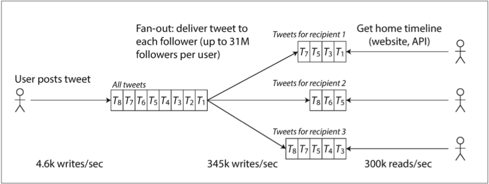

> 互联网做的如此之优秀以至于人们习以为常的认为这是一种例如太平洋的自然资源而不是人造的。谁还记得上一次如此规模而且没有差错的技术是什么时候
>
> ​                                                                                                                                            -----    Alan Kay

今天的许多应用是数据密集型的而不是计算密集型的。基本的 CPU 资源已经不是这些应用的瓶颈，更大的问题是数据的规模，复杂性以及变化的速度。

数据密集型的应用通常是通过提供常用功能的标准标准组件构建的。比如，许多应用需要：

- 存储数据，使得另一个应用稍后可以查询到（***databases***）
- 记录一次开销巨大的计算结果，加速读（***caches***）
- 允许用户通过多重组合对关键字进行搜索过滤（***search indexes***）
- 向另一个进程发送消息，异步处理（***stream processing***）
- 定期处理大量的累积数据（***batch processing***）

如果这听起来很痛苦，那是因为数据系统做了相当成功的抽象：我们只用不需要太多思考使用它们即可。当构建一个应用时，大多数工程师不会考虑写一个新的数据引擎，因为数据库已经用起来相当完美。

但是实际情况并不是那么简单。许多数据库系统具有不同的特性，因为不同的应用有不同的要求。存在多种进行缓存，多重构建索引的方法等等。当构建一个应用时，我们需要找到最适合手边任务的工具和方法。尤其是当单一工具无法完成你的任务时，将多重工具组合起来是一个挑战。

这本书是一个关于数据系统原理和实用性以及如何使用它们构建应用的探讨过程。我们将探讨不同工具的共同点，区别以及它们如何实现其特性。

在本章，我们将从探索基础概念开始：数据系统的可靠性、可扩展性、可维护性。我们将阐明这些名词的含义，为后续章节奠定基础。随后，在后面的章节中，我们将逐层展开，探讨当设计一个数据密集型的应用时，需要考虑的不同设计决策。

## Thinking about Data Systems

可靠性：系统可以持续正确的工作，即使出现硬件，软件甚至人为故障的时候

可扩展性：当系统的流量，数据量和复杂度增长时，有方式处理这种增长

可维护性：在一段时间里，会有许多不同的工作人员参与系统的开发和运营，他们应该都能有效的参与

## 可靠性

## 可扩展性

即使系统在今天可靠运行，也不意味着将来一定会可靠运行，降级的一个常见原因就是增加的负载：系统可能从 1 万并发用户增长到 10 万并发用户，或者从 1 百万增长到 1 千万。也许需要处理比之前大得多的数据量

可扩展性就是我们用来描述系统处理负载增长的能力。需要注意的是，对于系统的单个维度可扩展的标签是没有意义的（比如说 x 是可扩展的或者 y 是不可扩展的），对于讨论可扩展性的问题应该是这样的：“如果系统以特定的方式增长，我们应对增长的方式是什么？”或者 “我们如何为了处理增长的负载在系统中加入计算资源？”

### 描述负载

首先，我们需要能描述系统的当前负载，然后才能讨论负载增长的问题。负载可以通过一些量化的数字参数来描述。参数最好的选择依赖于系统的体系结构：web 服务的处理每秒请求量，数据库的读写速率，讨论组的真实在线用户，缓存命中率等等。或许你需要的是平均值，或者你需要的是限制瓶颈的少数参数值。

为了使得这个 idea 更加具体，我们拿 Twitter 来举例子，使用 2012 年 11 月发布的数据，Twitter 的两个主要操作是：

- 推送 tweet
  一个用户可以将消息推送给关注他的用户（平均 4.6k 条请求每秒，峰值超过 12k 条请求每秒）
- 拉取 tweet
  一个用户可以拉取关注的其他用户的消息（300k 条请求每秒）

简单处理 12k 写操作每秒（推送 tweet 的峰值量）相当简单，但是 Twitter 的可扩展性挑战不主要是 tweet 的数据量，而是扇出（fan-out），每个用户关注了很多用户，每个用户又被许多用户关注。有两种常见方案实现这两种操作：

1. 推送 tweet，就是在一个全局的 tweet 集合中插入新的 tweet。当一个用户拉取他所关注的用户消息时，查询，通过实践合并所有消息，在关系型数据库中，可以这样写一个查询：

   ```mysql
   SELECT tweets.*, users.* FROM tweets   JOIN users   ON tweets.sender_id    = users.id   JOIN follows ON follows.followee_id = users.id   WHERE follows.follower_id = current_user
   ```

   

2. 为每个用户的关注列表建立一个缓存--就像每个收信用户的邮箱。当一个用户推送了一条 tweet，查询所有关注此用户的用户，在每个用户对应的缓存里插入一条 tweet。请求读的处理才能快速，因为结果是提前计算的
   

第一个版本的 Twitter 使用方案 1，但是系统难以跟上查询关注用户的负载增长，所以公司改进为方案 2。这种方案的效果良好，因为推送的请求数量级比查询的数量级低两个，因此最好在写入时做更多的工作，读取时才能简单

但是，方案 2 的缺点就是需要在推送请求中做大量工作，平均一下，一条 tweet 需要传递给大概 75 个用户，所以每秒 4.6k 条 tweet 变成，每秒向缓存写入 345k 条请求。但是平均掩盖了一个存在大 V 的情况，有些用户可能有超过 3 千万的关注。这就意味着，一条推送 tweet 导致 3 千万的写缓存请求！及时做到这一点（Twitter 尝试在五秒内推送到所有关注者）是一项重大挑战。

在 Twitter 的例子中，每个用户的关注者分布（可能由用户的推送频率加权）就是讨论负载的一个关键负载参数，因为它确定了扇出（fan-out）负载。你的应用程序可能具有不同的特征，但是可以使用相似的原理来导出负载

Twitter 例子的最后总结：现在方案 2 已经被非常好的实现了，Twitter 正在尝试将方案 1 和方案 2 结合起来。大多数用户的 tweet 会在发布时扇出到缓存上，但是拥有大量关注者的少量用户除外。大 V 的推文像方案 1 一样被每个用户读取的时候分别拉取然后合并。这种混合方案能够提供出色的性能。我们会在介绍了更多的基础之后，在第 12 章重新研究此案例。

### 描述性能

当成功描述系统的负载之后，你可以发现当系统负载提高时，发生了什么，你可以从两个角度来看：

- 当你提升了负载，但是保持系统的资源（CPU，内存，网络带宽）不变时，你的系统性能表现如何？
- 当你提升了负载，为了保持系统性能不变，需要增加多少资源？

两个问题都需要性能量化，所以让我们来简单描述一下系统的性能。

在批处理系统中，比如 Hadoop，我们通常关心吞吐量-系统每秒能处理的记录条数，或者在一定体量的数据集上完成任务的时间。在在线系统中，服务的响应时间更为重要-从客户端发送请求到收到响应之间的时间段。

> 延迟和响应时间
>
> 延迟和响应时间通常被认为是同义的，但是并不完全对。响应时间是从客户端角度来看：包括服务端真实的处理时间，网络延迟和排队延迟。延迟就是一段等待处理的时间。

即使你一次又一地发出相同的请求，每次尝试的响应时间也会有所不同。实际上，系统处理不同请求的响应时间天差地别。因此考虑响应时间时不能作为单纯的一个数字，而是统计出来的数字的分布。

在下图中，每个灰色直方图表示一个请求，高度表示响应时间长短。大多数请求在合理时间内得到响应，但是偶尔会有异常情况导致的长时间开销。慢速处理的请求本质上可能开销确实更大，比如处理更多的数据。但是即使在同一个场景下的同一种请求也会出乎意料的存在不同的响应时间：随机延迟的引入可能是由后台进程的上下文切换，网络丢包，TCP 重连，GC，缺页中断，服务器基架的震动等许多问题造成的。


## 可维护性

众所周知，软件的大部分成本不在最初的开发中，而是在持续的维护时中修复 bug，保持系统的稳定运行，调查故障，适配新平台，为了新用途修改，还技术债，以及增加新功能。

但是不幸的是，大多数开发者不喜欢维护所谓的遗产系统--工作内容包括修复他人的错误，使用落后的平台，或者尝试开发本来系统没有规划的功能。每个遗产系统都以其自己的方式令人不快，因此很难给出处理这个问题的通用建议。

但是，我们在设计软件的时候，就应该采用使得维护过程痛苦最小化的方案。所以，我们在设计软件系统时，应该关注三点原则：

- 可运维性：使得运维团队可以轻松的保持系统正常运行
- 简单化：通过消除尽可能多的系统复杂性，使得新开发人员容易理解系统
- 可演化性：使得开发人员将来可以简单的修改系统，并根据需求的变化将其适用于没有规划过的用例。也被称为可扩展性、可修改性或者可塑性

就像之前讨论的可靠性和可扩展性，没有简单的方案来达成这一目标，但是，我们将尽可能来遵循可操作性、简单化、可演化性的原则来设计系统。

### 可运维性

有人提出，良好的运维性可以掩盖不良（或者不完整）软件的局限性，但是良好的软件不能通过差的运维可靠运行。尽管有些运维应该实现自动化，但是仍然需要人工来首先设置自动化参数并确保其正常工作。

运营团队对于保持软件系统的平稳运行至关重要。一个好的运维团队通常负责以下工作：

- 监控系统的健康程度，当发现系统不健康时迅速的恢复
- 追踪错误的原因，比如系统错误或者性能退化
- 保持软件和平台更新，包括安全补丁
- 密切关注不同系统之间的相互影响，从而避免在造成损坏之前进行修复
- 预测未来的可能问题，并在问题出现之前解决（比如服务容量的规划）
- 建立良好的部署，配置管理的习惯和工具
- 执行复杂的维护任务，比如将一个应用程序从一个平台迁移到另一个平台
- 在进行配置更改时维护系统的安全
- 定义操作流程使得操作可预期，并帮助保持生产系统的稳定
- 即使人员去留，保持对于系统的整体知识

好的运维意味着简单的日常任务，使得运维团队可以集中精力在更高价值的活动上。数据系统可以通过多种方式来简化日常运维：

- 提供可视化能力来监控系统的运行状态
- 提供自动化的良好支持和标准工具的整合
- 避免对于单个机器的依赖（在系统连续运行时，允许停止单个机器来维护）
- 提供良好的文档和容易理解的系统操作模型（如果操作 X，结果为 Y）
- 提供良好的默认行为，但是也要允许管理员自由的更改默认值
- 进行适当的自我修复，但是在需要时也可以让管理员手动控制系统状态
- 展现可预测的行为，最大程度减少意外

### 简单化：管理复杂性

小型的软件项目可以具有令人愉悦的简单和富有表现力的代码，但是当项目变大时，它们通常变得复杂，难以理解。这种复杂性减缓了系统新开发人员熟悉系统的速度，提升了维护成本。又是这种陷入了复杂性的软件被称为烂泥（***big ball of mud***）

可能存在多种复杂性的症状：状态空间爆炸，模块的紧耦合，依赖纠缠，不一致的命名空间和术语，旨在解决性能的 hack 代码，特列的专门处理代码等等，有太多这种话题。

当复杂性使得难以维护时，预算和计划就会超支。在复杂的软件中，进行更改时还存在引入错误的巨大风险：当开发人员难以理解系统时，更容易忽略**隐藏的假设**，**意外的结果**，**意外的交互。**相反，降低复杂度可以极大提高软件的可维护性，因此简化应该是构建系统的关键目标。

使系统更简单并不意味着减少功能；虽然这也意味着降低复杂性。Moseley 和 Marks 定义复杂性是偶然的，如果这不是因为解决某个软件问题必须引入的，而仅仅是因为具体实现。

我们移除偶然复杂性的最好工具就是***抽象***。好的抽象可以在干净，易于理解的接口内部隐藏大量实现细节。好的抽象还可以用于一系列不同的应用中。这种重用不仅比多次实现类似的东西高效，而且也能引导更高的软件质量，这会使得所有使用抽象的应用获得收益。（ps. 中间件？）

比如，高级编程语言就是隐藏了机器代码，CPU 寄存器，系统调用的抽象。SQL 是一种隐藏了复杂的磁盘和内存数据结构的，并行处理来自其他客户端请求以及 crash 后不一致情况的抽象。当然，当使用高级编程语言编程时，我们还是运行的机器码，只是没有直接编写机器码，高级编程语言的抽象使我们从其中解脱出来。

但是，发现好的抽象是挺困难的。在分布式系统领域，尽管有很多优秀的算法，但是我们如何将它们打包抽象来帮助将系统的复杂性降低保持到可管理的水平还不清楚。

在本书中，我们将始终保持良好的抽象态度，使得能够提取大型系统中良好的，可重用的组件。

### 可演化性：使改变简单

你的系统永远保持不变的可能性很小。它们更有可能保持不断变化：你了解到新的事实，出现了未预料的用例，业务优先级的改变，用户要求新的功能，新平台替代老平台，法律法规变更，系统增长导致的系统结构变化等。

在组织开发流程方面，敏捷开发模式提供了一个适应变化的开发框架。敏捷社区开发了技术工具和模式来帮助适应在频繁变化的环境中的软件开发，比如测试驱动开发（TDD）和重构。

大多数关于敏捷开发的讨论集中于相当小的，局部的规模（同一个应用的源代码）。在本书中，我们寻求在更大的数据系统中提升敏捷能力的方法，这个系统或许包括几种不同特性的多个应用或服务组成。例如，你如何为了缓存使用将 Twitter 的体系结构（描述负载一节提到）从方案 1 重构为方案 2。

你可以轻松的修改数据系统，使之适应修改的需求，这与它的简单性和良好抽象有关：简单和易于理解的系统比负载系统更容易修改。但是因为这是一个如此重要的观点，我们将使用一个不同的单词来表征数据系统的敏捷能力：可演化性。

## 总结

在本章中，我们探讨了一些有关数据密集型应用程序的基本思考方法。这些原则将指导我们完成本书的剩余部分，将深入技术细节。

一个应用必须能够满足各种需求。有功能需求（能做什么，比如允许数据存储，检索，搜索和以不同的方法处理），非功能性需求（像安全性，可靠性，合规性，可扩展性，兼容性以及可维护性这些通用特性）。这本章中，我们详细讨论了可靠性，可扩展性和可维护性。

***可靠性***意味着即使出现故障系统也能正常工作。故障可能出现在硬件（通常是随机且不相关的）、软件（bug 通常是系统性的且难以处理）、人（不可避免的时常犯错）。容错技术可以将其对终端用户隐藏起来。

***可扩展性***意味着即使负载提升，也能保持良好性能。为了讨论课扩展性，我们首先需要量化描述负载和性能。我们简单地讨论了 Twitter 的案例。在一个可扩展性系统中，你可以为了在高负载下保持可靠增加系统容量。

***可维护性***有很多方面，但是本质上改善该系统的开发和运维。良好的抽象可以降低复杂性，使得系统更容易修改和适应新需求。良好的运维性意味着系统健康度的可视化，以及有高效的方法管理系统。

不幸的是，没有使得应用可靠、可扩展或者可维护的简单修补程序。但是，某些模式和技术会在不同的应用中不断出现。在接下来的几章中，我们将研究一些数据系统示例并分析它们如何朝着这个目标努力。

稍后，在本书第三部分中，我们将研究多个组件协同工作的系统的模式。