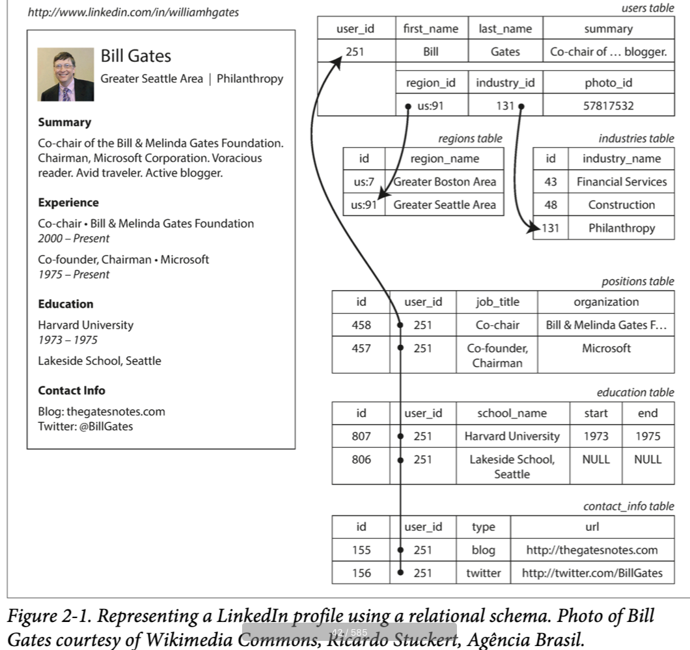
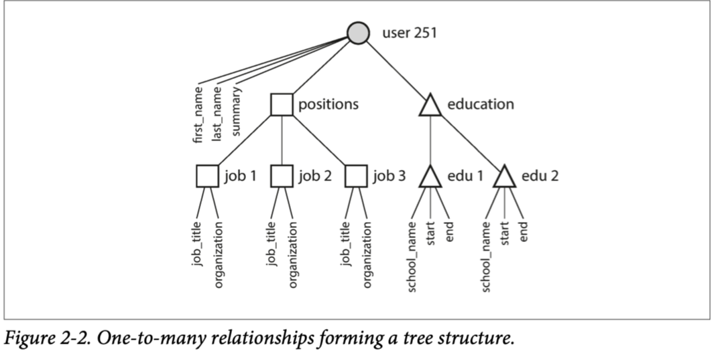
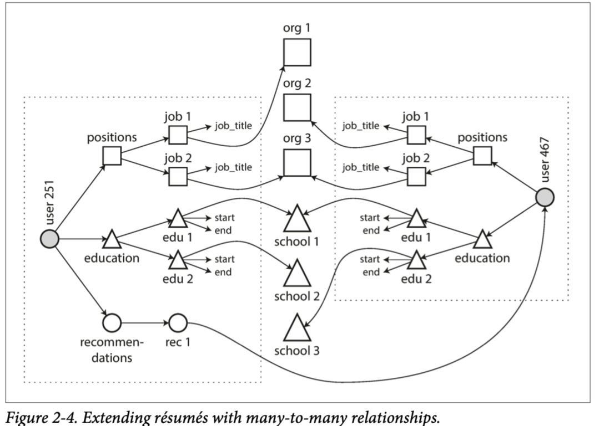

> 语言的限制意味着世界的限制 -- Ludwig Wittgenstein

数据模型可能是软件开发最重要的一部分，因为它们的影响是如此巨大：不仅是软件如何写，而且关于我们对于问题解决的思考。

大多数应用是通过在不同层级堆叠数据模型构建的。对于每层关键问题是：如何在下一层表现它？比如：

1. 作为一个应用开发者，你看到了真实世界（有人，组织，商品，行为，货币流，传感器等），然后通过对象的数据结构来建模它们，并通过 APIs 来操作它们。这些结构通常是应用特定的
2. 当你想要存储这些数据结构时，你可以使用通用数据模型表达，比如JSON或者XML，关系型数据库中的表，或者图模型
3. 你的软件数据库决定了你的数据使用第2点中提到的哪种数据模型存储在硬盘上。然后通过不同的方式来对数据进行查询，索引，操作和处理。
4. 在底层，硬件工程师已经解决了如何在电流，光脉冲，磁场中表示字节

在一个复杂的应用中可能有更多的内部层级，比如在 APIs 上构建 APIs，但是基本思想是相同的：每一层都通过提供一个干净的数据模型隐藏了下面层的复杂性。这些抽象允许不同的人群--比如，数据库工程师和应用开发者一起高效使用数据库

存在很多不同类型的数据模型，每种都体现了如何使用的假设。某种用法很容易，有些不支持；一些操作很快，有些很差；有些数据转换很自然，有的很丑陋。

掌握一种数据模型就要花费大量精力（想想看有多少本介绍关系数据模型的书）。构建软件是困难的，即使只使用一种数据模型并且不考虑内部如何工作。同时数据模型的选择又对软件能做什么不能做什么有着巨大影响，应用关于数据模型的选择是如此重要

在本章我们将要讨论一系列通用数据模型以及查询。尤其是，我们比较关系模型，文档模型以及少部分图模型。我们将讨论一些查询语言并对比它们的使用。在[第三章](../chapter3-storage-retrieval)，我们讨论存储引擎如何工作，详细说明了数据模型如何实现。

## Relational Model Versus Document Model
当今最知名的数据模型是 SQL，基于 Edgar Codd 在 1970 年提出的关系模型：数据被组织成关系（ SQL 中称为 table），每组关系时无序的 tuple 集合（SQL 中称为 row）

关系模型是作为理论被提出来的，当时很多人怀疑这种模型能否被高效实现。但是在20世纪80年代中期，RDBMS 和 SQL 已经成为人们存储和查询数据的首选。关系数据库的主导地位持续了 25-30 年，在计算机历史上是不朽的

关系数据库的根源是20世纪6,70年代的大型机上执行的业务数据处理。从今天的角度看：经典的事务处理（销售，银行交易，航空公司订单，仓库中的股票保留）和批处理（发票，工资单，报告）

其他数据库强制应用开发者思考数据库中的数据表示。关系模型的目标就是将实现细节隐藏于清晰的接口后

多年来，数据存储和查询一直处于很活跃的状态，在20世纪70年代和80年代早期，*网络模型*和*层级模型*是主要替代者，但是最终关系模型胜出。对象数据库在20世纪80年代末期和90年代初再次回归。在2000年出现了 XML 数据库，但是应用范围很窄。每个竞争对手都会发起挑战，但是最终都是关系模型胜出。

随着计算机越来越强大，并且联网，数据库被用于更多的目的。关系型数据库开始延伸到业务数据处理和批处理之外的领域。今天你看到的 Web，在线发布，讨论，社交网络，电子商务，游戏，SaaS产品，大多数也是由关系型数据库支撑的

### The Birth of NoSQL
现在，21世纪10年代，NoSQL 是推翻关系型数据库的最新尝试，NoSQL这个名字是不幸的，因为实际上没有引用任何特定的技术--他最初是 Twiiter 在一次开源，分布式，非关系型数据库会议上提出的。尽管如此，这个名词还是循序传播到 Web 的各处。现在很多有趣的数据库都关联了 #NoSQL 标签，而且被引申为 Not Only SQL

NoSQL 数据有几种驱动力，包括：

- 比关系型数据库更好的可扩展性，包括非常大的数据集或者很高的写吞吐
- 很多开源免费软件超过了商业软件
- 有些特殊的查询操作不被关系型数据库支持
- 关系模式的限制，对于更多动态和表现力数据模型的追求

不同的应用有不同的要求，对一种场景的技术选择不适用另一种场景。因此，在可预见的未来，关系数据库与非关系数据库会一直一起使用。

### The Object-Relational Mismatch

今天的大多数应用由面向对象语言开发，这导致 SQL 数据模型有一个共有的问题：如果数据存储在关系表中，需要一个丑陋的转换层将对象转换为表的 row，或者转换回来。模型间的关系有时被称为*阻抗匹配*

Object-relational Mapping(ORM) 框架减少了转换层所需的样板代码量，但是无法完全隐藏两种模型之间的差异

比如，图 2-1 表明简历可以存储为关系模式。这份建立可以由唯一的 user_id 确定。像 first_name last_name 等字段只会出现一次，所有可以保存在 users 表中，但是大多数人有多个工作经历，并且可能有不同的教育经历，以及不等数目的联系方式。这些项目存在单对多的关系，可以以不同的方式表达：



- 在传统 SQL 模型中，最常用的方法是正则化表达，将工作经历，教育经历，联系方式分别放在单独的表中，然后关联到 users 表的外键，如图 2-1 中表示
- SQL 更高的版本增加了对结构化数据类型和 XML 数据的支持；这允许将多值数据存储在单行中，并支持在这些文档中进行查询和索引。Oracle、IBM DB2、MS SQL Server 和 PostgreSQL 都在不同程度上支持这些特性。一些数据库也支持 JSON 数据类型，包括 IBM DB2、MySQL 和 PostgreSQL。
- 第三个选择是编码工作经历，教育经历和联系方式为 JSON 或者 XML 文档，然后存储在数据库中为 text 列，然后应用在解析内容。这种方法，显然你不能使用数据库的查询。

对于简历这样的数据结构，是自包含文档，JSON相当适合，如下：

```json
{   
  "user_id":     251,   
  "first_name":  "Bill",   
  "last_name":   "Gates",   
  "summary":     "Co-chair of the Bill & Melinda Gates... Active blogger.",   
  "region_id":   "us:91",   
  "industry_id": 131,   
  "photo_url":   "/p/7/000/253/05b/308dd6e.jpg",
  "positions": [     
    {"job_title": "Co-chair", "organization": "Bill & Melinda Gates Foundation"},     
    {"job_title": "Co-founder, Chairman", "organization": "Microsoft"}   
  ],   
  "education": [     
    {"school_name": "Harvard University",       "start": 1973, "end": 1975},     
    {"school_name": "Lakeside School, Seattle", "start": null, "end": null}  
  ],   
  "contact_info": {     
    "blog":    "http://thegatesnotes.com",     
    "twitter": "http://twitter.com/BillGates"   
  } 
}
```

一些开发者认为 JSON 模型降低了应用代码和存储层的阻抗匹配。然而，JSON也存在数据编码格式的问题。缺乏模式通常被引用为优势。

JSON 表示有更好的局部性，当你想要从关系型存储中拉取一份简历时，需要执行多次查询。JSON 表示，所有相关数据都存储在一起，一次查询搞定

单对多关系可以表示为树状，JSON 使得这种结构更清晰



### Many-to-One and Many-to-Many Relationships

上面的 json 例子中居住地使用id，是为了减少重复，但是 id 到人类可读的地名映射需要 join 到查询中，通常文档型数据库对 join 的支持比较弱，这是多对单的关系。如果数据库不支持 join，这部分开发量就转移到了应用代码中，通常需要多次查询，本例中地区的列表比较少，应该还不是什么大问题。

但是即使原始版本的应用很适合没有join的文档模型，数据都有内部不断连接的趋势。比如，考虑我们的简历例子

- 组织和学校改为对应的网站连接
- 互相写推荐信

下图表明，这些新特性需要多对多关系



方块可以归类为某个文档，但是组织，学校的引用，以及互相的推荐，都是引用，并且查询时需要 join

### Are Document Databases Repeating History?

多对多关系重新引发了人们对于数据如何表示的讨论，是关系数据库，文档数据库，还是 NoSQL 数据库。但是这种讨论实际比 NoSQL 早多了，事实上，需要回溯到计算机数据库系统早期

20世纪70年代对于业务数据处理最知名的数据库是 IBM 的 IMS，首次发布于 1968年。今天仍然在 OS/390 中使用

IMS 的设计使用了相当简单的数据模型，*层级模型*，类似JSON，将数据表示为树形嵌套结构

如同文档数据库，IMS 对于 单对多关系处理的很好，但是难以处理多对多关系，不支持 join。开发者不得不考虑复制数据多份到各处，这个问题很像现在人们对于文档数据库的质疑

为了解决层级模型的限制，多种方案被提出。最突出的就是关系模型（占领世界）和网络模型，两个阵营的伟大争论在20世纪70年代一直持续。

由于这两个模型所解决的问题在今天仍然如此重要，因此在今天的情况下，值得简要回顾一下。

#### network model

是对层级结构的延展，层级结构中，每个 record 有一个父亲，但是在网络模型中，每个 record 有多个父亲。

网络模型中的 record 之间的链接不是外键，更像是编程语言中的指针。

#### the relational model

#### comparison to document databases

### Relational Versus Document Databases Today

## Query Languages for Data

### Declarative Queries on the Web

### MapReduce Querying

## Graph-like Data Models

### Property Graphs

### The Cypher Query Language

### Graph Queries in SQL

### Triple-Stories and SPARQL

### The Foundation: Datalog

## Summary

数据模型是个相当大的主题，本章中我们快速浏览了几种不同的数据模型。没有对每种数据模型进行详细展开，但是希望概述已经可以帮助你发现更多模型信息使之更好的适配你的应用要求。

从历史上看，数据开始表示为一个大树（分层模型），但这对表示多对多关系不利，所以关系模型被发明来解决这个问题。最近，开发者发现一些应用不适合使用关系模型，新的非关系型 "NoSQL" 数据存储主要向两个方向发展：

1. 文档数据库，目标场景是数据来自与自包含的文档，文档之间关系很弱
2. 图数据库，与文档数据库相反，数据之间的联系更重要

这三种模型（document, relational, graph）今天都被广泛应用，每种都有自己的杀手场景。一种模型可以模拟为另一种模型，比如，图数据可以存储在关系数据库中，但是结果通常比较丑陋。这就是我们需要不同系统的原因，没有统一的解决方案。

文档和图数据库的共同点是不强制它们存储数据的 schema，使得应用适配更新更容易。但是，你的应用还是假设数据有一种结构；只是 schema 是显式还是隐式的问题。

每种数据模型都有自己的查询语言和框架，我们讨论了集中例子：SQL，MapReduce，MongoDB 的聚集 pipeline，Cypher，SPARQL，和 Datalog。我们还涉及了 CSS 和 XSL/XPath，不是查询语言但是有相似之处。

尽管我们涉及了很大的范围，但是还有很多数据模型我们没有讨论到。这里给一个简单例子：

- 基因数据的研究者需要执行序列相似度查询，意思是有一个非常长的字符串（表示基因序列），然后从很大的字符串数据库中挑选出与之最相似的一个，但是不能相同。没有现存的数据库可以处理这种操作，所有研究者开发了这种数据库，比如 GenBank
- 粒子物理学家数十年一直进行大数据规模的数据分析，像大型强子对撞机这样的项目需要处理数百 PB 级别的数据！这样的规模下，需要定制解决方案来防止硬件成本无限上涨
- 全文检索也是一种常见的数据模型。信息检索是一个大型专业主题，我们不会在本书中详细介绍，但是我们会在[第三章](../chapter3-storage-retrieval)涉及到搜索索引

我们不得不先暂停这个话题了。在下一章中，我们将要讨论在实现本章讨论数据模型时的权衡。

