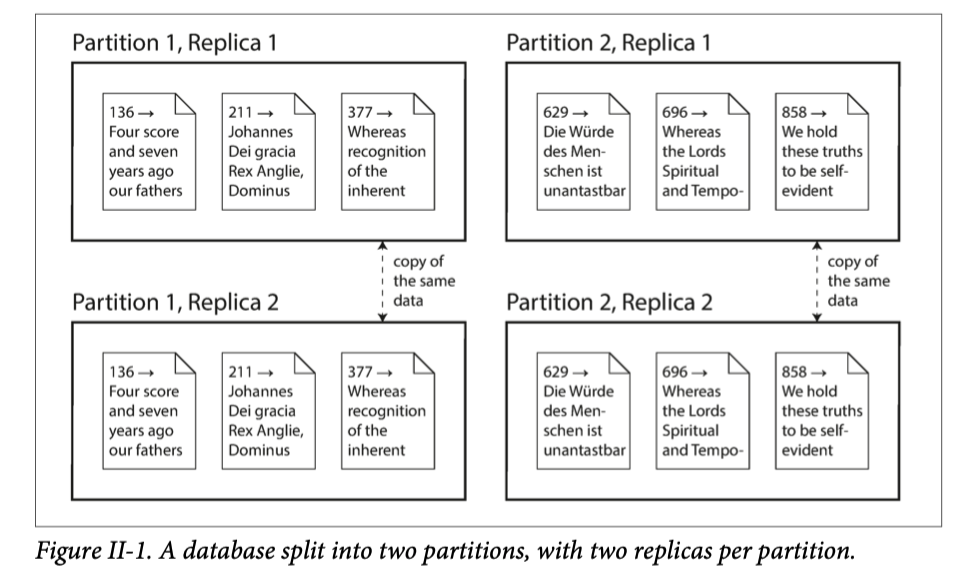

在本书的 [第一部分](../part1.FoundationasOfDataSystems)，我们讨论了存储于单机的数据系统的各个方面。现在，在 [第二部分](./)，我们升级一下问题：如果多台计算机参与数据存储和检索会发生什么？

出于多重原因，您可能希望数据系统跨计算机分布：

- 可扩展性
  如果你的数据量，读写负载已经超过了单机处理的最高水平，可能会想将负载均衡到多台计算机
- 容错性/高可用性
  如果你的应用在即使一台计算机（或者几台计算机，网络，甚至整个数据中心）发生宕机后仍然能继续工作，则需要多台机器提供冗余，当一个系统宕机，可以有备份系统来接管
- 延迟
  如果你的用户遍布全球，则可能需要在全球各地部署服务，以便全球的用户在最近的数据中心来访问服务。这样避免了用户网络的延迟

#### 扩展到更高的负载

如果你需要提升负载，最简单的方案就是购买一台性能更好的机器（有时称为垂直扩展）。可以在一个操作系统下将许多 CPU，许多 RAM 芯片和许多磁盘连接在一起，并且快速互连允许任何 CPU 访问内存或磁盘的任何部分。在这种共享内存体系结构中，所有组件都可以视为一台机器。

这种共享内存的方法的问题是成本增长太快：两倍 CPU，两倍 RAM，两倍硬盘容量的机器的价格远不止两倍。而且由于系统瓶颈，两倍硬件的机器可能并不能处理两倍的负载。

这种共享内存的方法只能提供有限的容错能力，即使是高端热拔插组件的计算机在地理位置这个维度，容错能力也是有限的。

另一种方案是共享硬盘存储，可以多台机器有独立的 CPU 和 RAM，但是共享硬盘存储（通过快速的网络）。这种体系结构用于某些数据仓库的场景，但是数据竞争和锁限制了这种方案的可扩展性。

#### 无共享架构

相比之下，无共享架构（有时也称为水平扩展）广受欢迎。这种方案中，每台运行数据库的物理机或者虚拟机被称为节点（***node***）, 每个节点使用独立的 CPU，RAM 和硬盘。节点之间的协调都通过网络在软件层面进行。

无共享系统不需要任何特殊的硬件，所以你可以最具性价比的机器。还可以将机器分布在不同的地理位置，从而使得用户都拥有最近的服务器使用，并且可以避免整个数据中心丢失。通过上云虚拟机的方式，即使对于小型公司，也可以采用多区域分布式架构了。

在本书的这一部分，我们重点关注无共享架构，并不是因为对于每种场景都是最佳选择，而是因为，对于开发者来说，这里面的坑最多。如果你的数据分布在不同的节点，你就需要了解在分布式系统中的约束和其中的关于一致性/正确性的权衡等。

尽管无共享分布式架构具有很多优点，但是它通常会给应用带来额外的复杂性，并且有时会限制数据模型的表达能力。（PS（译者著）.redis 单机版和集群版对比，集群版的数据支持要少于单机版）在某些情况下，一个简单的单线程程序可能要比具有 100 个 CPU 核心的集群程序性能要好。另一方面，无共享架构可以表现的非常强大。接下来的章节将讨论一些数据分布中出现问题的细节。

#### 复制 VS 分区

有两种常见的方式将数据分布到多个节点上：

- 复制
  将相同的数据的副本保存在多个不同的节点（可能处于不同的地理位置）。复制提供冗余：即使某些节点不可用，仍然可以从其他节点提供数据。复制还可以提高性能，我们将在 [第 5 章](./chapter5-replication) 讨论复制
- 分区
  将大型数据库拆分为较小的子集称为分区，以便可以将不同分区分配给不同的节点（也称为分片）。我们将在 [第 6 章](./chapter6-partitioning) 讨论分区

这是两种独立的机制，而且它们经常并存，如图II-1

了解了这些概念之后，我们需要在分布式系统中进行艰难的权衡。在 [第 7 章](./chapter7-transactions) 中，我们讨论事务，这将帮助你理解数据系统中可能出错的地方以及如何处理。在 [第 8 章](./chapter8-distrubutedsystemstrouble) 和 [第 9 章](./chapter9-consistency-consensus) 中，我们讨论分布式系统重要的局限性。

然后，在本书的 [第三部分](../part3.DerivedData)，我们将讨论如何使用多重数据存储，并将其整合到一个巨大复杂的应用体系中。这种系统构建的需求通常被号称满足一切需求的供应商所忽略。首先，我们来讨论分布式数据。